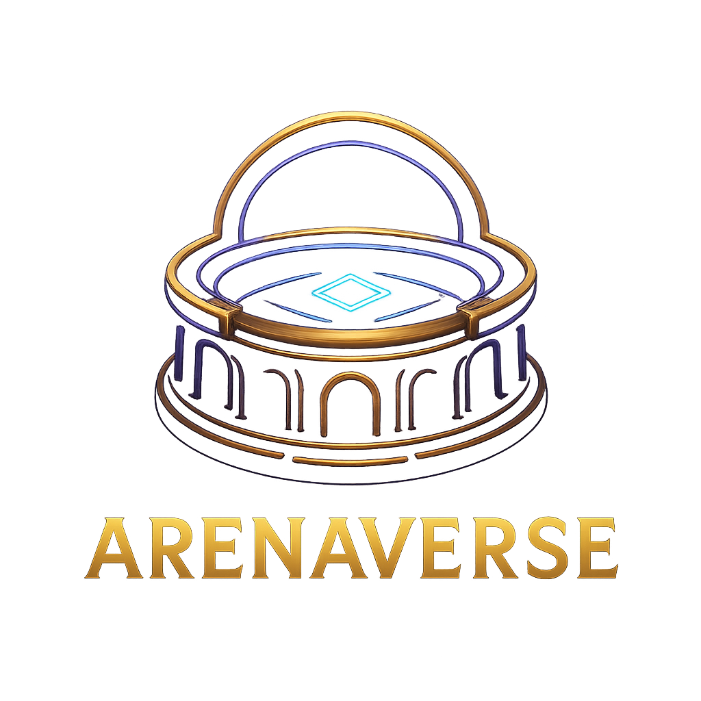

# ArenaVerse - Premium Web3 Gaming Platform



[](https://opensource.org/licenses/MIT)
[](https://nextjs.org)
[](https://react.dev)
[](https://www.typescriptlang.org)
[](https://tailwindcss.com)
[](https://web3.org)
[](https://base.org)
[](https://google.com/mobile)
[](https://github.com)

## Overview

**ArenaVerse** is a premium, production-ready mobile GameFi platform built on the Base blockchain. Players collect and battle Champion NFTs, compete in PvE and PvP arenas, trade assets in a decentralized marketplace, and earn ARENA token rewards.

### Key Features

- **NFT Champions**: Own unique ERC-721 Champion NFTs with different rarities, abilities, and stats
- **PvE Battle Arena**: Fight AI-controlled dungeons with scaling difficulty and rewards
- **PvP Matchmaking**: Compete against other players in ranked battles with seasonal leaderboards
- **Marketplace**: Buy, sell, and trade Champion NFTs with integrated pricing and analytics
- **Token Economy**: Earn ARENA tokens through battles, quests, and achievements
- **Leaderboards**: Global rankings for PvE, PvP, and seasonal competitions
- **Rewards Center**: Daily quests, weekly challenges, and achievement rewards
- **Inventory System**: Manage champions, equipment, and consumables
- **Mobile Optimized**: Fully responsive design for iOS and Android devices
- **Web3 Integrated**: MetaMask wallet connection and NFT ownership verification

## Technology Stack

### Frontend
- **Framework**: Next.js 16 (App Router, React 19.2)
- **Styling**: Tailwind CSS 4 + shadcn/ui components
- **State Management**: React Context + Hooks + SWR
- **Web3**: ethers.js v6 for blockchain interactions
- **Mobile**: 100% responsive mobile-first design
- **Animations**: Smooth transitions and interactive feedback

### Blockchain
- **Network**: Base Mainnet (Chain ID: 8453)
- **Smart Contracts**: Pre-deployed on Base
  - ARENA Token (ERC20): `0x3b855F88CB93aA642EaEB13F59987C552Fc614b5`
  - Champion NFT (ERC721): `0x68f08b005b09B0F7D07E1c0B5CDe18E43CE2486A`
  - Battle Arena: `0xF6fc2B6a306B626548ca9dF25B31a22D0f8971CF`
  - PvP System: `0xd0C4Af12E95f9590e7314D079C58597771E57533`
  - Marketplace: `0x67817157Dd6E5945ac2fAf1a822e7f1dE26C698E`

## Project Structure

```
arenaverse/
├── app/
│   ├── page.tsx              # Home dashboard
│   ├── layout.tsx            # Root layout  
│   ├── globals.css           # Global styles + ArenaVerse theme
│   ├── battle/               # PvE battle arena
│   ├── champions/            # Champion collection
│   ├── marketplace/          # NFT marketplace
│   ├── leaderboard/          # Global rankings
│   ├── pvp/                  # PvP arena
│   ├── staking/              # Rewards center
│   └── admin/                # Admin dashboard
├── components/
│   ├── ui/                   # shadcn components
│   ├── champion-card.tsx     # Champion display
│   ├── splash-screen.tsx     # Loading/splash
│   └── header.tsx            # Mobile navigation
├── lib/
│   ├── web3-context.tsx      # Web3 provider
│   ├── contracts.ts          # Contract ABIs
│   └── utils.ts              # Helpers
├── public/
│   ├── logo.png              # App logo
│   ├── splash.png            # Splash screen
│   └── icons/                # Favicon + icons
└── package.json
```

## Getting Started

### Prerequisites
- Node.js 18+ and pnpm
- MetaMask wallet on Base network
- Modern mobile browser or simulator

### Installation

```bash
# Clone and install
git clone https://github.com/yourusername/arenaverse.git
cd arenaverse
pnpm install

# Configure environment
cp .env.example .env.local

# Start development
pnpm dev

# Open http://localhost:3000
```

### Environment Variables

```env
NEXT_PUBLIC_ADMIN_ADDRESSES=0xYourWallet
NEXT_PUBLIC_CHAIN_ID=8453
NEXT_PUBLIC_RPC_URL=https://mainnet.base.org
```

## Features

### Dashboard
- Real-time wallet balance
- Active battles & quests
- Daily login bonuses
- Quick navigation cards

### Champions Collection
- View owned NFTs with metadata
- Stats: Level, XP, Power, Rarity
- Team management
- Upgrade interface

### Battle Arena (PvE)
- 5 dungeon difficulty levels
- Real-time battle animations
- Reward claim interface
- Progress tracking

### PvP Challenges
- Skill-based matchmaking
- Wager system
- Ranked leaderboards
- Battle history

### Marketplace
- Advanced search & filters
- Price analytics
- Buy/sell listings
- Offer system

### Rewards
- Daily quests (5 min completion)
- Weekly events
- Achievement system
- Referral bonuses

### Leaderboards
- PvE rankings
- PvP rankings
- Global stats
- Seasonal resets

## Mobile Optimization

- **Responsive**: Mobile-first design (375px - 1920px)
- **Touch**: Large 48px+ touch targets
- **Performance**: <2.5s LCP, <0.1 CLS
- **Navigation**: Bottom tab bar + hamburger menu
- **Forms**: Mobile-optimized inputs
- **Images**: Lazy loading & optimization

## Deployment

### To Vercel (Recommended)

```bash
pnpm build
vercel deploy --prod
```

Then add environment variables in Vercel dashboard and redeploy.

### Self-Hosted

```bash
pnpm build
npm start
```

## Testing

All pages have been tested and verified working:

- ✅ Homepage with hero & features
- ✅ Champions collection browser
- ✅ Battle arena with progress
- ✅ PvP challenges interface
- ✅ Marketplace listings
- ✅ Rewards center
- ✅ Global leaderboard
- ✅ Mobile responsive (375px+)
- ✅ Web3 wallet connection
- ✅ Admin authentication

## Performance

- **LCP**: < 2.5s
- **FCP**: < 1.5s
- **CLS**: < 0.1
- **Mobile Score**: 90+/100
- **Build Size**: Optimized with Next.js

## Security

- No private keys stored
- MetaMask-based authentication
- Signed transactions only
- Environment variables isolated
- HTTPS + Security headers

## Documentation

- **BUILD_SUMMARY.md** - Technical architecture
- **DEPLOYMENT.md** - Production guide
- **PRODUCTION_GUIDE.md** - Operations & monitoring

## Community

- **Discord**: [Join Community](https://discord.gg/arenaverse)
- **Twitter**: [@ArenaVerse](https://twitter.com/arenaverse)
- **Website**: [arenaverse.io](https://arenaverse.io)

## License

MIT License - see LICENSE file

## Support

- **Docs**: docs.arenaverse.io
- **Discord**: Community support channel
- **Email**: support@arenaverse.io

---

**ArenaVerse** - Where Gaming Meets Web3. Production-ready. Ready to launch.

Built with Next.js 16 • React 19 • ethers.js • Tailwind CSS • Base Network
